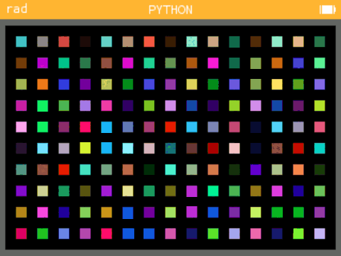

# Zelik-Numworks

Zelik-Numworks est une application qui affiche un labyrinthe multi-couleur qui s'agrandit à chaque tour. Ce projet est conçu pour être utilisé sur les calculatrices NumWorks.

## Fonctionnalités

- Génération d'un labyrinthe dynamique
- Agrandissement du labyrinthe à chaque tour
- Affichage multi-couleur pour une meilleure expérience visuelle

## Exemples d'application

Voici quelques exemples de l'application en action :

*Equivalent d'un code Python disponible sur le workshop de Numworks*

## Installation

Pour installer Zelik-Numworks sur votre calculatrice NumWorks, suivez ces étapes :

1. Téléchargez le fichier `.nwa` depuis la [page des versions](https://github.com/paul-zelik/zelik-numworks/releases).
2. Connectez votre calculatrice NumWorks à votre ordinateur.
3. Utilisez l'outil de transfert NumWorks pour transférer le fichier `.nwa` sur votre calculatrice.
4. Redémarrez votre calculatrice et sélectionnez Zelik depuis le menu.

## Utilisation

Pour utiliser Zelik-Numworks :

1. Lancez l'application depuis le menu de votre calculatrice NumWorks.
2. Utilisez la Touches `OK` pour rénistialiser le labyrinthe.
3. Observez le labyrinthe s'agrandir et changer de couleur à chaque tour.

## Contributeurs

Un grand merci à tous nos contributeurs :

- [Paul Betinelli](https://github.com/paul-zelik)
- [Ecco](https://github.com/Ecco)
- [Emilie Numworks](https://github.com/EmilieNumworks)
- [SquarePoint](https://my.numworks.com/python/squarepoint)

Si vous souhaitez contribuer à Zelik-Numworks, n'hésitez pas à soumettre une pull request ou à ouvrir une issue. Contactez moi par email : betinellipaul@byflash.fr

## Licence

Ce projet est sous licence [MIT](LICENSE). Disponible sur Epsilon, Omega et Upsilon.
